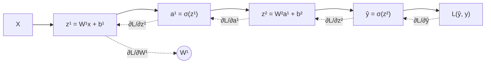

+++
date = '2026-04-24'
draft = false
title = '反向传播算法：神经网络是如何学习的'
tags = ['深度学习', '数学', 'Python']
categories = ['AI']
math = true
+++

反向传播（Backpropagation）是深度学习的核心，但很多人只会调用 `loss.backward()`，没有真正理解背后发生了什么。这篇文章从链式法则出发，手推一个两层网络的梯度。

<!--more-->

## 前向传播

考虑一个两层全连接网络：

$$z^{[1]} = W^{[1]} x + b^{[1]}$$

$$a^{[1]} = \sigma(z^{[1]})$$

$$z^{[2]} = W^{[2]} a^{[1]} + b^{[2]}$$

$$\hat{y} = \sigma(z^{[2]})$$

损失函数（二元交叉熵）：

$$\mathcal{L} = -\left[ y \log \hat{y} + (1 - y) \log(1 - \hat{y}) \right]$$

## 链式法则

反向传播本质是链式法则（Chain Rule）的高效应用：

$$\frac{\partial \mathcal{L}}{\partial W^{[1]}} = \frac{\partial \mathcal{L}}{\partial a^{[2]}} \cdot \frac{\partial a^{[2]}}{\partial z^{[2]}} \cdot \frac{\partial z^{[2]}}{\partial a^{[1]}} \cdot \frac{\partial a^{[1]}}{\partial z^{[1]}} \cdot \frac{\partial z^{[1]}}{\partial W^{[1]}}$$

## 逐层推导

**第二层梯度**：

$$\delta^{[2]} = \hat{y} - y$$

$$\frac{\partial \mathcal{L}}{\partial W^{[2]}} = \delta^{[2]} \cdot (a^{[1]})^T, \quad \frac{\partial \mathcal{L}}{\partial b^{[2]}} = \delta^{[2]}$$

**第一层梯度**（Sigmoid 导数 $\sigma'(z) = \sigma(z)(1-\sigma(z))$）：

$$\delta^{[1]} = (W^{[2]})^T \delta^{[2]} \odot \sigma'(z^{[1]})$$

$$\frac{\partial \mathcal{L}}{\partial W^{[1]}} = \delta^{[1]} \cdot x^T, \quad \frac{\partial \mathcal{L}}{\partial b^{[1]}} = \delta^{[1]}$$

其中 $\odot$ 表示逐元素乘法（Hadamard 积）。

## NumPy 手动实现

```python
import numpy as np

def sigmoid(z):
    return 1 / (1 + np.exp(-z))

def sigmoid_grad(z):
    s = sigmoid(z)
    return s * (1 - s)

class TwoLayerNet:
    def __init__(self, n_in, n_hidden, n_out, lr=0.01):
        self.W1 = np.random.randn(n_hidden, n_in) * 0.01
        self.b1 = np.zeros((n_hidden, 1))
        self.W2 = np.random.randn(n_out, n_hidden) * 0.01
        self.b2 = np.zeros((n_out, 1))
        self.lr = lr

    def forward(self, X):
        self.X = X
        self.z1 = self.W1 @ X + self.b1
        self.a1 = sigmoid(self.z1)
        self.z2 = self.W2 @ self.a1 + self.b2
        self.y_hat = sigmoid(self.z2)
        return self.y_hat

    def backward(self, y):
        m = y.shape[1]

        # 第二层
        dz2 = self.y_hat - y                        # (n_out, m)
        dW2 = (dz2 @ self.a1.T) / m
        db2 = dz2.mean(axis=1, keepdims=True)

        # 第一层
        dz1 = (self.W2.T @ dz2) * sigmoid_grad(self.z1)
        dW1 = (dz1 @ self.X.T) / m
        db1 = dz1.mean(axis=1, keepdims=True)

        # 更新参数
        self.W2 -= self.lr * dW2
        self.b2 -= self.lr * db2
        self.W1 -= self.lr * dW1
        self.b1 -= self.lr * db1

    def loss(self, y):
        eps = 1e-8
        return -np.mean(y * np.log(self.y_hat + eps) +
                        (1 - y) * np.log(1 - self.y_hat + eps))
```

## 计算图视角



实线为前向传播，虚线为反向传播的梯度流动。

## 为什么 ReLU 比 Sigmoid 更常用

Sigmoid 在输入很大或很小时，$\sigma'(z) \approx 0$，导致梯度接近零——**梯度消失**问题。

ReLU 的导数：

$$\text{ReLU}'(z) = \begin{cases} 1 & z > 0 \\ 0 & z \le 0 \end{cases}$$

正区间梯度恒为 1，有效缓解了梯度消失，这也是为什么深层网络默认用 ReLU。

理解了反向传播，再看 Adam、BatchNorm、Dropout 的设计，就会发现它们都在解决"梯度如何更好地流动"这个本质问题。
