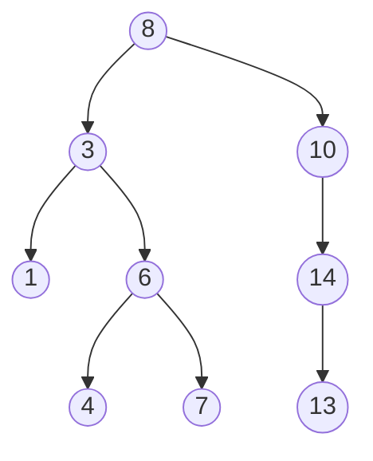
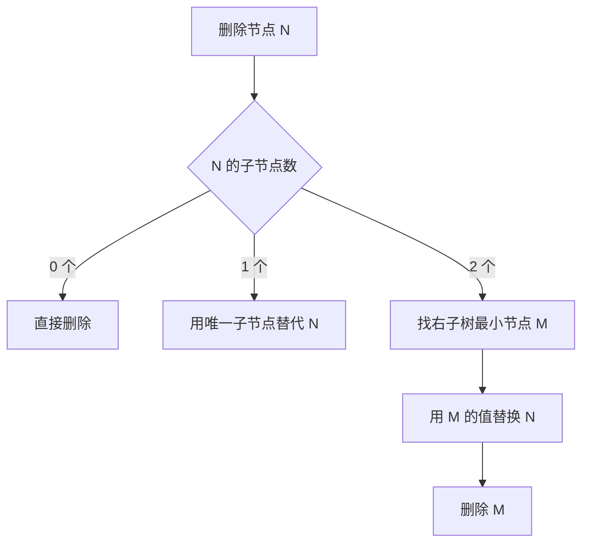

+++
date = '2026-02-17'
draft = false
title = '二叉搜索树：原理、实现与复杂度分析'
tags = ['算法', '数据结构', 'Go']
categories = ['技术']
math = true
+++

二叉搜索树（BST）是面试和实际工程中都绕不开的数据结构。这篇文章用 Go 实现一棵完整的 BST，并分析每个操作的时间复杂度。

<!--more-->

## BST 的核心性质

对于任意节点 $N$：
- 左子树所有节点的值 $< N.val$
- 右子树所有节点的值 $> N.val$
- 左右子树也分别是 BST



## Go 实现

```go
type Node struct {
    Val   int
    Left  *Node
    Right *Node
}

type BST struct {
    Root *Node
}

// 插入
func (t *BST) Insert(val int) {
    t.Root = insertNode(t.Root, val)
}

func insertNode(node *Node, val int) *Node {
    if node == nil {
        return &Node{Val: val}
    }
    if val < node.Val {
        node.Left = insertNode(node.Left, val)
    } else if val > node.Val {
        node.Right = insertNode(node.Right, val)
    }
    return node
}

// 搜索
func (t *BST) Search(val int) bool {
    return searchNode(t.Root, val)
}

func searchNode(node *Node, val int) bool {
    if node == nil {
        return false
    }
    if val == node.Val {
        return true
    }
    if val < node.Val {
        return searchNode(node.Left, val)
    }
    return searchNode(node.Right, val)
}

// 中序遍历（结果有序）
func (t *BST) InOrder() []int {
    result := []int{}
    var traverse func(*Node)
    traverse = func(node *Node) {
        if node == nil {
            return
        }
        traverse(node.Left)
        result = append(result, node.Val)
        traverse(node.Right)
    }
    traverse(t.Root)
    return result
}
```

## 删除节点

删除是 BST 中最复杂的操作，需要处理三种情况：



```go
func deleteNode(node *Node, val int) *Node {
    if node == nil {
        return nil
    }
    if val < node.Val {
        node.Left = deleteNode(node.Left, val)
    } else if val > node.Val {
        node.Right = deleteNode(node.Right, val)
    } else {
        // 找到目标节点
        if node.Left == nil {
            return node.Right
        }
        if node.Right == nil {
            return node.Left
        }
        // 找右子树最小值（中序后继）
        min := findMin(node.Right)
        node.Val = min.Val
        node.Right = deleteNode(node.Right, min.Val)
    }
    return node
}

func findMin(node *Node) *Node {
    for node.Left != nil {
        node = node.Left
    }
    return node
}
```

## 时间复杂度分析

设树高为 $h$：

| 操作 | 平均情况 | 最坏情况（退化为链表） |
|------|---------|---------------------|
| 插入 | $O(\log n)$ | $O(n)$ |
| 搜索 | $O(\log n)$ | $O(n)$ |
| 删除 | $O(\log n)$ | $O(n)$ |

**退化场景**：当插入数据本身有序时（如 1, 2, 3, 4, 5），BST 退化为链表，高度 $h = n$。

## 自平衡 BST

为了保证 $O(\log n)$ 的最坏性能，实际工程中使用自平衡变体：

- **AVL 树**：严格保持 $|h_L - h_R| \le 1$，查找性能最优
- **红黑树**：放松平衡约束，插入/删除更快，Go `map` 底层实现
- **B 树 / B+ 树**：多路搜索树，用于数据库索引（MySQL InnoDB）

标准库的 `sort.Search` 使用的就是类似 BST 的二分思想，理解了 BST，这些都是自然延伸。
