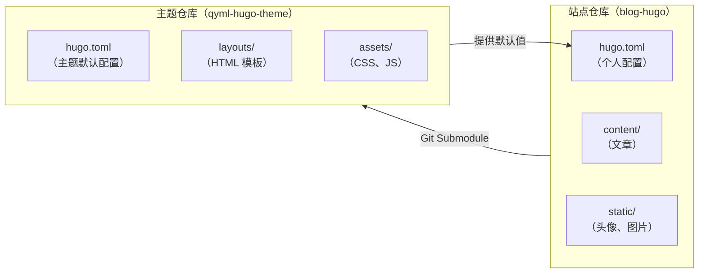
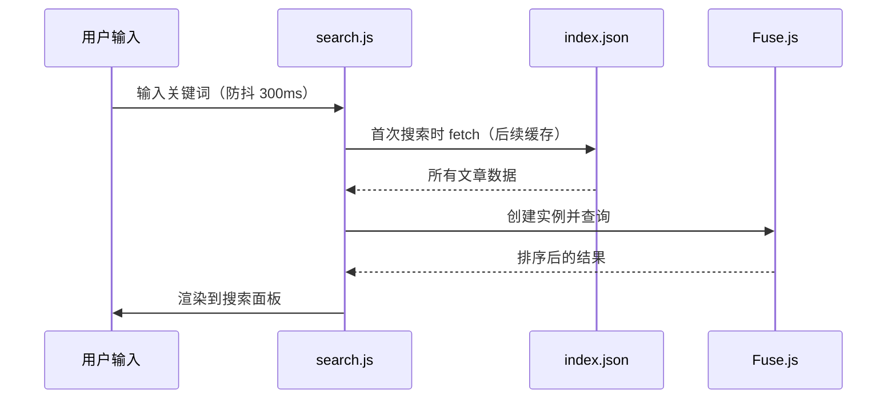

+++
date = '2026-05-20'
draft = false
title = '博客主题开发总结：设计决策与技术选型'
tags = ['Hugo', '建站', '设计', 'CSS']
categories = ['建站']
+++

这个博客主题从第一行代码到现在经历了多次重写。这篇文章记录最重要的几个设计决策，以及它们背后的思考。

<!--more-->

## 技术选型

| 方向 | 选择 | 放弃的选项 | 原因 |
|------|------|-----------|------|
| 静态生成器 | Hugo | Astro、Hexo | 构建速度、单二进制 |
| 样式方案 | 原生 CSS + 变量 | Tailwind、CSS Modules | 减少外部依赖 |
| 搜索 | Fuse.js + JSON 索引 | Algolia、Pagefind | 零服务器，纯客户端 |
| 图表 | Mermaid | D3.js | 声明式，Markdown 友好 |
| 数学公式 | KaTeX | MathJax | 渲染速度更快 |
| 评论 | 占位（预留接口） | Disqus、Giscus | 暂不需要 |

## 架构设计

主题和站点完全分离：



**好处**：
- 主题可以被多个博客复用
- 个人配置和主题代码独立提交
- 主题可以单独发布、打 tag

## CSS 变量设计

所有颜色、间距都通过 CSS 变量管理，亮色/深色模式只需替换一组变量：

```css
:root {
  --bg: #ffffff;
  --text: #111827;
  --muted: #6b7280;
  --border: #e5e7eb;
  --accent: #000000;
}

[data-theme="dark"] {
  --bg: #0a0a0a;
  --text: #ededed;
  --muted: #a1a1aa;
  --border: #262626;
  --accent: #ffffff;
}
```

这样组件样式完全不需要感知当前是亮色还是深色，只用变量即可。

## 搜索实现

搜索分三层：



`index.json` 由 Hugo 在构建时生成，包含标题、URL、摘要和全文。Fuse.js 在前端做模糊匹配，零服务器成本。

## 移动端适配

移动端最棘手的问题是导航。最终方案：
- 桌面端：水平导航栏，子菜单悬停展开
- 移动端：汉堡菜单，点击后向下渐入，子菜单直接展开（不需要二次点击）

```css
/* 移动端搜索框字号锁定，防止 iOS 自动缩放 */
.search-input {
  font-size: 1rem; /* 不能小于 16px */
}
```

iOS 只要表单字体小于 16px，就会自动缩放整个页面——这是一个非常隐蔽的坑。

## 待办

- [ ] 评论系统（Giscus，基于 GitHub Discussions）
- [ ] 全文搜索结果高亮
- [ ] 文章目录（TOC）侧栏
- [ ] 阅读进度条
- [ ] 图片懒加载 + WebP 自动转换

博客主题的开发是一个不断迭代的过程，够用就好，不要追求完美，先把内容写起来才是正道。
