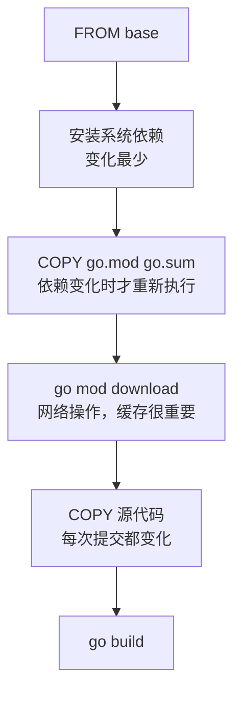

+++
date = '2026-03-01'
draft = false
title = 'Docker 容器化实践：从 Dockerfile 到多阶段构建'
tags = ['Docker', '运维', '后端']
categories = ['技术']
+++

Docker 已经成为后端开发的标配。这篇文章记录了我在实际项目中总结出来的 Dockerfile 最佳实践，以及多阶段构建如何大幅压缩镜像体积。

<!--more-->

## 为什么容器化

本地跑得好、上线就崩——这个问题容器化从根本上解决了。容器把应用和它的依赖打包在一起，保证运行环境完全一致。

## 一个典型的 Go 应用 Dockerfile

**初版（有问题）**：

```dockerfile
FROM golang:1.22
WORKDIR /app
COPY . .
RUN go build -o server .
CMD ["./server"]
```

这个镜像有两个严重问题：
1. 基础镜像 `golang:1.22` 体积约 800MB
2. 源代码和构建工具都打进了镜像

## 多阶段构建

```dockerfile
# ── 构建阶段 ──
FROM golang:1.22-alpine AS builder
WORKDIR /app

# 先复制依赖文件，利用层缓存
COPY go.mod go.sum ./
RUN go mod download

# 再复制源码并构建
COPY . .
RUN CGO_ENABLED=0 GOOS=linux go build -ldflags="-s -w" -o server .

# ── 运行阶段 ──
FROM scratch
COPY --from=builder /app/server /server
COPY --from=builder /etc/ssl/certs/ca-certificates.crt /etc/ssl/certs/
EXPOSE 8080
ENTRYPOINT ["/server"]
```

**效果对比**：

| 方案 | 镜像大小 |
|------|---------|
| 单阶段（golang:1.22） | ~850 MB |
| 多阶段（alpine 基础） | ~20 MB |
| 多阶段（scratch 基础） | ~8 MB |

## 层缓存策略

Docker 按层构建，层一旦变化，后续所有层都会重新构建。关键原则：**把变化频率低的操作放前面**。



## .dockerignore

```gitignore
.git
.gitignore
*.md
tmp/
.env
.env.*
```

不加 `.dockerignore` 的话，`.git` 目录会被复制进构建上下文，拖慢速度。

## Docker Compose 本地开发

```yaml
# docker-compose.yml
services:
  app:
    build: .
    ports:
      - "8080:8080"
    environment:
      - DATABASE_URL=postgres://user:pass@db:5432/mydb
    depends_on:
      db:
        condition: service_healthy

  db:
    image: postgres:16-alpine
    environment:
      POSTGRES_USER: user
      POSTGRES_PASSWORD: pass
      POSTGRES_DB: mydb
    volumes:
      - pgdata:/var/lib/postgresql/data
    healthcheck:
      test: ["CMD-SHELL", "pg_isready -U user -d mydb"]
      interval: 5s
      timeout: 5s
      retries: 5

volumes:
  pgdata:
```

```bash
docker compose up -d       # 后台启动
docker compose logs -f app  # 跟踪日志
docker compose down -v     # 停止并清理数据卷
```

## 常用调试命令

```bash
# 进入运行中的容器
docker exec -it <container_id> sh

# 查看镜像每层大小
docker history myapp:latest

# 清理无用资源
docker system prune -af
```

容器化不是银弹，但它确实让"环境一致性"这个长期困扰开发团队的问题得到了彻底解决。
