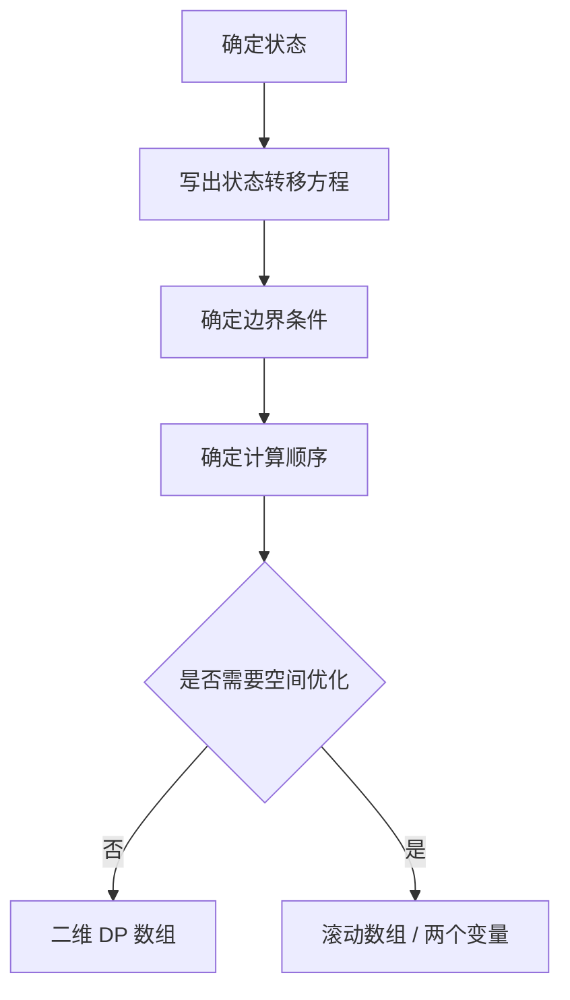

+++
date = '2026-03-29'
draft = false
title = '动态规划入门：从记忆化搜索到状态转移'
tags = ['算法', '动态规划', 'Python']
categories = ['技术']
math = true
+++

动态规划（DP）是算法面试中频率最高的考点。很多人觉得 DP 难，其实难在"状态设计"，而不是代码本身。这篇文章用三道经典题讲清楚 DP 的思维过程。

<!--more-->

## DP 的本质

DP 解决的是**有重叠子问题的最优化问题**。两个关键条件：

1. **最优子结构**：原问题的最优解包含子问题的最优解
2. **重叠子问题**：相同的子问题会被反复计算

## 例题一：爬楼梯

> 每次可以爬 1 或 2 级台阶，爬 $n$ 级有多少种方法？

**状态定义**：$f(n)$ = 爬 $n$ 级台阶的方案数

**状态转移方程**：

$$f(n) = f(n-1) + f(n-2), \quad f(1) = 1, \quad f(2) = 2$$

```python
# 方法一：记忆化递归（自顶向下）
from functools import lru_cache

@lru_cache(maxsize=None)
def climb(n: int) -> int:
    if n <= 2:
        return n
    return climb(n - 1) + climb(n - 2)

# 方法二：迭代（自底向上，空间 O(1)）
def climb_dp(n: int) -> int:
    if n <= 2:
        return n
    a, b = 1, 2
    for _ in range(3, n + 1):
        a, b = b, a + b
    return b

print(climb_dp(10))  # 89
```

## 例题二：最长公共子序列（LCS）

> 给定两个字符串 $s$ 和 $t$，求最长公共子序列的长度。

**状态定义**：$dp[i][j]$ = $s[0..i-1]$ 与 $t[0..j-1]$ 的 LCS 长度

**状态转移**：

$$dp[i][j] = \begin{cases} dp[i-1][j-1] + 1 & \text{若 } s[i-1] = t[j-1] \\ \max(dp[i-1][j],\ dp[i][j-1]) & \text{否则} \end{cases}$$

```python
def lcs(s: str, t: str) -> int:
    m, n = len(s), len(t)
    dp = [[0] * (n + 1) for _ in range(m + 1)]

    for i in range(1, m + 1):
        for j in range(1, n + 1):
            if s[i-1] == t[j-1]:
                dp[i][j] = dp[i-1][j-1] + 1
            else:
                dp[i][j] = max(dp[i-1][j], dp[i][j-1])

    return dp[m][n]

print(lcs("ABCBDAB", "BDCAB"))  # 4 → "BCAB"
```

## 例题三：0-1 背包

> 有 $n$ 件物品，第 $i$ 件重量 $w_i$，价值 $v_i$。背包容量 $W$，每件只能取一次，求最大价值。

**状态定义**：$dp[i][j]$ = 前 $i$ 件物品，容量 $j$ 时的最大价值

**状态转移**：

$$dp[i][j] = \begin{cases} dp[i-1][j] & j < w_i \\ \max(dp[i-1][j],\ dp[i-1][j-w_i] + v_i) & j \ge w_i \end{cases}$$

```python
def knapsack(weights, values, W):
    n = len(weights)
    # 空间优化：滚动数组
    dp = [0] * (W + 1)

    for i in range(n):
        # 从右往左遍历，防止同一件物品重复使用
        for j in range(W, weights[i] - 1, -1):
            dp[j] = max(dp[j], dp[j - weights[i]] + values[i])

    return dp[W]

weights = [2, 3, 4, 5]
values  = [3, 4, 5, 6]
print(knapsack(weights, values, 8))  # 10
```

## DP 思维框架



## 复杂度对比

| 题目 | 时间 | 空间（优化前/后） |
|------|------|-----------------|
| 爬楼梯 | $O(n)$ | $O(n)$ / $O(1)$ |
| LCS | $O(mn)$ | $O(mn)$ / $O(\min(m,n))$ |
| 0-1 背包 | $O(nW)$ | $O(nW)$ / $O(W)$ |

DP 的难点在于状态定义。每次做题前先问自己：**"我需要哪些信息来描述当前的决策现场？"** 答案就是状态。
