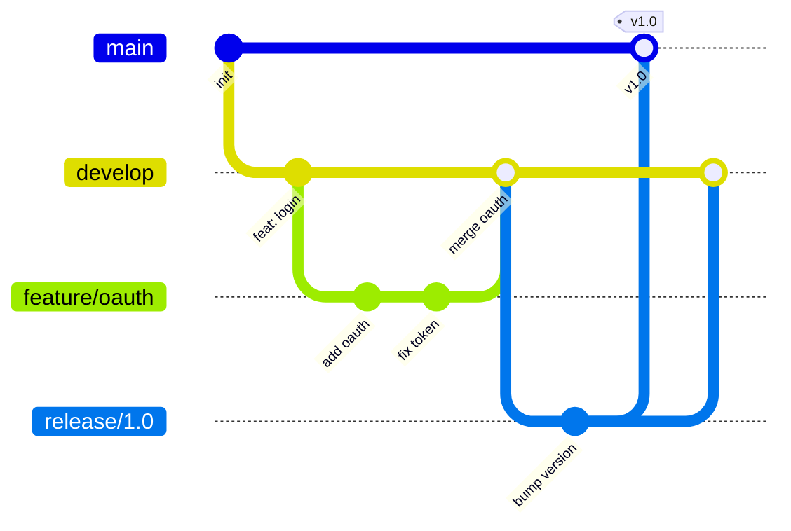
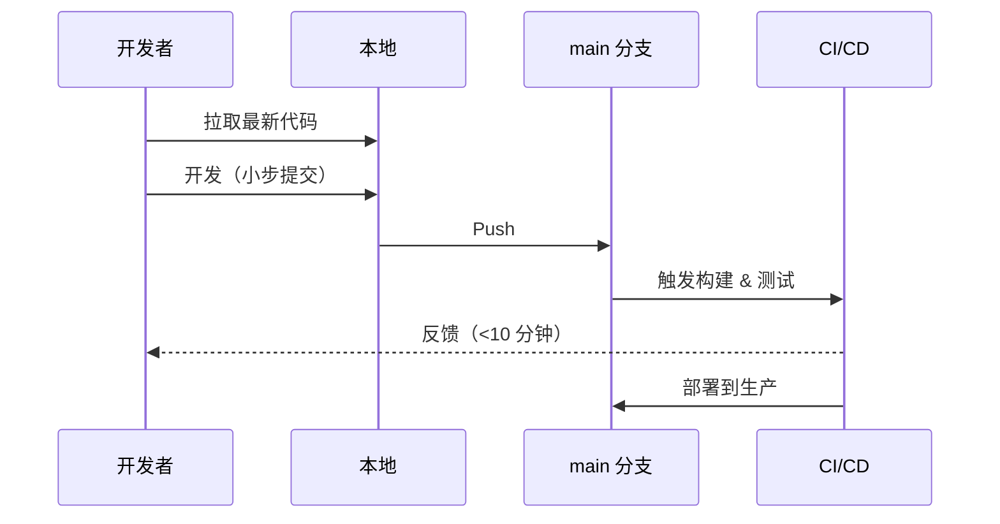

+++
date = '2026-03-16'
draft = false
title = 'Git 分支策略：Trunk-Based vs Git Flow'
tags = ['Git', '工程实践', '团队协作']
categories = ['工程']
+++

分支策略选错了，代码合并会成为噩梦。这篇文章对比了两种主流策略，并给出适合不同团队规模的建议。

<!--more-->

## Git Flow

Git Flow 是 Vincent Driessen 在 2010 年提出的，适合有明确发布周期的项目。



**核心分支**：
- `main`：生产环境代码，只接受合并，打 tag
- `develop`：集成分支，日常开发在此汇集
- `feature/*`：功能开发分支，从 develop 切出
- `release/*`：发布准备分支
- `hotfix/*`：生产紧急修复

**缺点**：分支太多，合并频繁，CI/CD 反馈慢。

## Trunk-Based Development（TBD）

所有人都提交到 `main`（或 `trunk`），小步快跑，频繁集成。



**配套实践**：
- **Feature Flag**：未完成功能用开关控制，代码可以提前合并
- **小批量变更**：每次 PR 改动不超过 400 行
- **全面的自动化测试**：没有充分测试覆盖，TBD 不可行

## 对比总结

| 维度 | Git Flow | Trunk-Based |
|------|---------|-------------|
| 适合团队规模 | 中大型，有明确发版节奏 | 任何规模，尤其是持续交付团队 |
| 发布频率 | 周/月 | 日/多次 |
| 分支复杂度 | 高（5 类分支） | 低（1–2 个分支） |
| CI/CD 集成 | 较复杂 | 天然友好 |
| 学习曲线 | 较陡 | 较平缓 |

## 我的实践建议

**个人项目 / 小团队（<5 人）**：直接用 TBD，配合 PR + Squash Merge。

**中型团队，有多环境**：简化版 Git Flow，只保留 `main` + `develop` + `feature/*`，去掉 release 分支，用 tag 标记版本。

**Commit Message 规范**（建议统一）：

```
<type>(<scope>): <subject>

feat(auth): add OAuth2 login
fix(api): handle empty response correctly
docs(readme): update deployment guide
refactor(db): extract connection pool logic
```

保持提交历史清晰，是团队协作的隐形基础设施。
