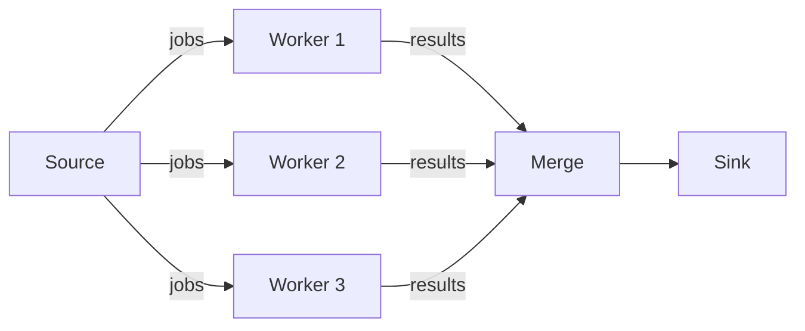

+++
date = '2026-01-19'
draft = false
title = 'Go 语言并发模型：Goroutine 与 Channel 实战'
tags = ['Go', '并发', '后端']
categories = ['技术']
math = false
+++

Go 的并发不是多线程，而是基于 CSP（Communicating Sequential Processes）模型。理解这个区别，才能写出真正惯用的 Go 代码。

<!--more-->

## Goroutine 不是线程

Goroutine 是 Go 运行时管理的轻量级协程，初始栈只有 2KB（线程通常 1–8MB），可以轻松开启数十万个。

```go
package main

import (
    "fmt"
    "sync"
)

func worker(id int, wg *sync.WaitGroup) {
    defer wg.Done()
    fmt.Printf("worker %d 开始\n", id)
    // 模拟工作...
    fmt.Printf("worker %d 结束\n", id)
}

func main() {
    var wg sync.WaitGroup
    for i := 1; i <= 5; i++ {
        wg.Add(1)
        go worker(i, &wg)
    }
    wg.Wait()
}
```

## Channel：Go 的通信哲学

> Don't communicate by sharing memory; share memory by communicating.

```go
func producer(ch chan<- int) {
    for i := 0; i < 5; i++ {
        ch <- i
    }
    close(ch)
}

func main() {
    ch := make(chan int, 3) // 带缓冲的 channel
    go producer(ch)
    for v := range ch {
        fmt.Println(v)
    }
}
```

## 并发模式

### Fan-out / Fan-in



实现 Fan-in：

```go
func merge(cs ...<-chan int) <-chan int {
    var wg sync.WaitGroup
    out := make(chan int)

    output := func(c <-chan int) {
        for v := range c {
            out <- v
        }
        wg.Done()
    }

    wg.Add(len(cs))
    for _, c := range cs {
        go output(c)
    }

    go func() {
        wg.Wait()
        close(out)
    }()
    return out
}
```

## Select：多路复用

```go
func main() {
    ch1 := make(chan string)
    ch2 := make(chan string)

    go func() { ch1 <- "来自 ch1" }()
    go func() { ch2 <- "来自 ch2" }()

    for i := 0; i < 2; i++ {
        select {
        case msg := <-ch1:
            fmt.Println(msg)
        case msg := <-ch2:
            fmt.Println(msg)
        }
    }
}
```

## 常见陷阱

| 问题 | 原因 | 解决方案 |
|------|------|---------|
| goroutine 泄漏 | channel 永远阻塞 | 使用 `context` 控制生命周期 |
| 数据竞争 | 多个 goroutine 读写同一内存 | 用 channel 或 `sync.Mutex` |
| 死锁 | 两个 goroutine 互相等待 | 检查 channel 发送接收对称性 |

## 用 context 控制超时

```go
ctx, cancel := context.WithTimeout(context.Background(), 2*time.Second)
defer cancel()

select {
case result := <-doWork(ctx):
    fmt.Println("完成:", result)
case <-ctx.Done():
    fmt.Println("超时:", ctx.Err())
}
```

Go 的并发设计哲学很简洁——用通信来共享数据，而不是锁。理解了这个，很多"高并发"问题都会迎刃而解。
