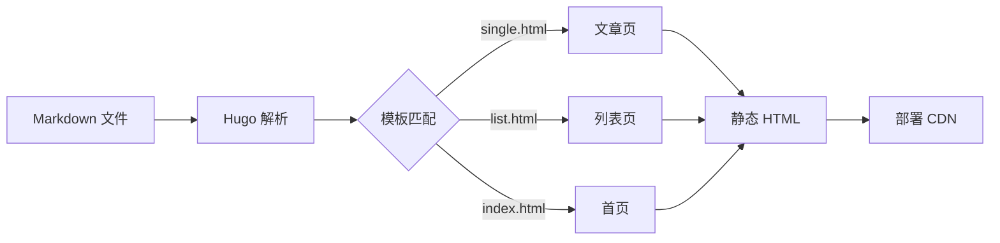

+++
date = '2026-01-08'
draft = false
title = '用 Hugo 从零搭建个人博客'
tags = ['Hugo', '建站', 'Go']
categories = ['建站']
+++

从买域名到博客上线，这篇记录了我踩过的所有坑，以及最终选择 Hugo + 自写主题的完整过程。

<!--more-->

## 为什么选 Hugo

市面上的静态博客框架不少：Jekyll、Hexo、Gatsby、Astro……选择困难症发作了好几天。最终选 Hugo 主要有三个原因：

1. **构建速度极快** — 几百篇文章也能在 100ms 内完成
2. **单二进制发布** — 不需要 Node.js 生态，只有一个可执行文件
3. **Go 模板系统** — 学习曲线陡，但理解后非常强大

## 项目结构

```
blog-hugo/
├── content/          # Markdown 文章
│   └── posts/
├── themes/
│   └── qyml-hugo-theme/   # 独立主题仓库（Git Submodule）
├── static/           # 静态资源
└── hugo.toml         # 站点配置
```

## 主题与站点分仓库

主题作为独立的 Git 仓库，通过 Submodule 链接到站点仓库。这样主题可以被多个站点复用，也方便单独迭代。

```bash
# 初始化主题子模块
git submodule add https://github.com/yourname/qyml-hugo-theme themes/qyml-hugo-theme

# 更新主题到最新 commit
git submodule update --remote themes/qyml-hugo-theme
```

## Hugo 构建流程



## 踩坑记录

### 坑 1：草稿文章不显示

新建文章默认 `draft = true`，本地预览记得加 `-D` 参数：

```bash
hugo server -D   # 包含草稿
hugo server      # 不包含草稿（接近生产状态）
```

### 坑 2：主题配置优先级

Hugo 配置合并顺序（优先级从高到低）：

| 层级 | 位置 |
|------|------|
| 最高 | 命令行参数 |
| 高 | 站点 `hugo.toml` |
| 低 | 主题 `hugo.toml` |

### 坑 3：Taxonomy 模板路由

Hugo 有两种 taxonomy 相关页面：
- `/tags/` → `taxonomy.html`（所有标签的汇总页）
- `/tags/go/` → `term.html`（单个标签下的文章列表）

两个模板不能混用，分开写清楚很重要。

## 部署

最终部署到 Cloudflare Pages，每次 push 自动触发构建，全球 CDN 加速，免费套餐完全够用。

```bash
hugo --minify   # 生成压缩后的静态文件到 public/
```
