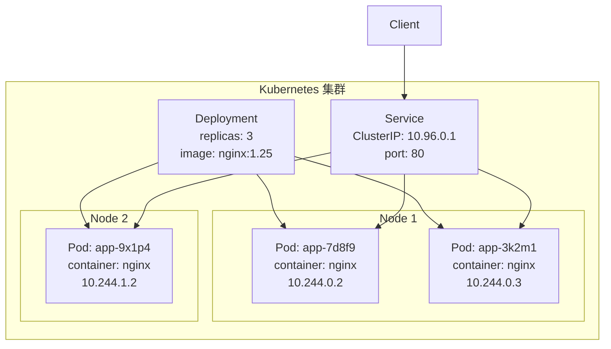

+++
date = '2026-04-10'
draft = false
title = 'Kubernetes 核心概念：Pod、Deployment 与 Service'
tags = ['Kubernetes', 'Docker', '运维']
categories = ['工程']
+++

K8s 的学习曲线很陡，但理解清楚几个核心概念后，很多东西就豁然开朗了。这篇文章不讲 K8s 的所有资源类型，只讲最常用的三个：Pod、Deployment、Service。

<!--more-->

## 核心组件关系



## Pod：最小调度单元

Pod 是 K8s 调度的最小单位，可以包含一个或多个容器，它们共享网络命名空间和存储卷。

```yaml
# pod.yaml
apiVersion: v1
kind: Pod
metadata:
  name: my-pod
  labels:
    app: myapp
spec:
  containers:
    - name: app
      image: nginx:1.25-alpine
      ports:
        - containerPort: 80
      resources:
        requests:
          memory: "64Mi"
          cpu: "250m"
        limits:
          memory: "128Mi"
          cpu: "500m"
      livenessProbe:
        httpGet:
          path: /healthz
          port: 80
        initialDelaySeconds: 10
        periodSeconds: 5
```

**不要直接管理 Pod**，Pod 不会自动重启——这是 Deployment 的职责。

## Deployment：声明式管理

Deployment 描述"期望状态"，Controller 负责让实际状态与期望状态一致。

```yaml
# deployment.yaml
apiVersion: apps/v1
kind: Deployment
metadata:
  name: myapp
spec:
  replicas: 3
  selector:
    matchLabels:
      app: myapp
  strategy:
    type: RollingUpdate
    rollingUpdate:
      maxSurge: 1        # 最多多出 1 个 Pod
      maxUnavailable: 0  # 始终保持 replicas 个 Pod 可用
  template:
    metadata:
      labels:
        app: myapp
    spec:
      containers:
        - name: app
          image: nginx:1.25-alpine
          ports:
            - containerPort: 80
```

```bash
# 滚动更新镜像版本
kubectl set image deployment/myapp app=nginx:1.26-alpine

# 查看滚动更新状态
kubectl rollout status deployment/myapp

# 回滚
kubectl rollout undo deployment/myapp
```

## Service：稳定的网络入口

Pod 的 IP 是不固定的，Service 提供一个稳定的虚拟 IP（ClusterIP），通过 Label Selector 找到后端 Pod。

```yaml
# service.yaml
apiVersion: v1
kind: Service
metadata:
  name: myapp-svc
spec:
  selector:
    app: myapp          # 匹配 Deployment 的 label
  ports:
    - protocol: TCP
      port: 80          # Service 端口
      targetPort: 80    # Pod 端口
  type: ClusterIP       # 仅集群内部可访问
```

**Service 类型**：

| 类型 | 场景 |
|------|------|
| `ClusterIP` | 集群内部服务间通信（默认） |
| `NodePort` | 开发测试，通过节点 IP 直接访问 |
| `LoadBalancer` | 云环境，自动分配外部负载均衡 |
| `ExternalName` | 将服务名映射到外部 DNS |

## 常用命令速查

```bash
# 查看资源
kubectl get pods -o wide
kubectl get deployment myapp
kubectl describe pod <pod-name>

# 查看日志
kubectl logs <pod-name> -f
kubectl logs <pod-name> --previous  # 崩溃后查看上次日志

# 进入容器
kubectl exec -it <pod-name> -- sh

# 应用配置
kubectl apply -f deployment.yaml

# 扩缩容
kubectl scale deployment myapp --replicas=5
```

K8s 的设计哲学是**声明式**——你只需要告诉它"我要什么"，而不是"怎么做"。理解了这一点，再看其他概念（StatefulSet、ConfigMap、HPA）都是顺水推舟。
