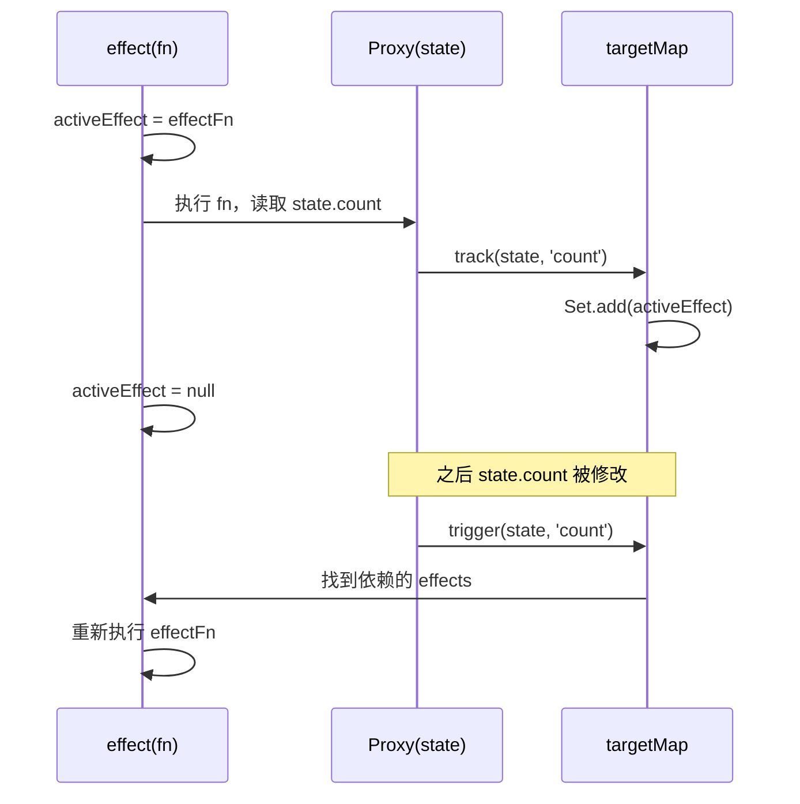

+++
date = '2026-05-06'
draft = false
title = 'Vue 3 响应式系统：Proxy 与依赖追踪原理'
tags = ['Vue', 'JavaScript', '前端']
categories = ['技术']
+++

Vue 3 用 `Proxy` 重写了响应式系统，性能和能力都有质的提升。这篇文章从源码角度解释 `ref`、`reactive` 的实现原理，以及依赖收集是怎么工作的。

<!--more-->

## Vue 2 vs Vue 3 响应式对比

| 特性 | Vue 2（`Object.defineProperty`） | Vue 3（`Proxy`） |
|------|--------------------------------|----------------|
| 新增属性检测 | ❌ 需要 `Vue.set` | ✅ 自动检测 |
| 数组下标修改 | ❌ 不响应 | ✅ 自动检测 |
| 删除属性 | ❌ 需要 `Vue.delete` | ✅ 自动检测 |
| 性能 | 初始化时递归劫持所有属性 | 懒代理，按需递归 |

## 响应式核心：Proxy + Reflect

```javascript
// 简化版 reactive 实现
function reactive(raw) {
  return new Proxy(raw, {
    get(target, key, receiver) {
      const res = Reflect.get(target, key, receiver)
      // 依赖追踪：记录"谁"在访问"哪个属性"
      track(target, key)
      // 深层响应：如果属性值是对象，递归代理
      return typeof res === 'object' && res !== null
        ? reactive(res)
        : res
    },
    set(target, key, value, receiver) {
      const res = Reflect.set(target, key, value, receiver)
      // 触发更新：通知所有依赖该属性的副作用重新执行
      trigger(target, key)
      return res
    },
    deleteProperty(target, key) {
      const res = Reflect.deleteProperty(target, key)
      trigger(target, key)
      return res
    }
  })
}
```

## 依赖追踪：track 与 trigger

```javascript
// WeakMap<object, Map<key, Set<effect>>>
const targetMap = new WeakMap()

// 当前正在执行的副作用（effect）
let activeEffect = null

function track(target, key) {
  if (!activeEffect) return
  
  let depsMap = targetMap.get(target)
  if (!depsMap) targetMap.set(target, (depsMap = new Map()))
  
  let deps = depsMap.get(key)
  if (!deps) depsMap.set(key, (deps = new Set()))
  
  deps.add(activeEffect) // 建立双向关联
}

function trigger(target, key) {
  const depsMap = targetMap.get(target)
  if (!depsMap) return
  
  const deps = depsMap.get(key)
  deps?.forEach(effect => effect())
}
```

## effect：副作用函数

```javascript
function effect(fn) {
  const effectFn = () => {
    activeEffect = effectFn
    fn()               // 执行 fn 时，访问到的响应式属性会 track 当前 effect
    activeEffect = null
  }
  effectFn()           // 立即执行一次，完成依赖收集
  return effectFn
}
```

**完整运行示例**：

```javascript
const state = reactive({ count: 0, name: 'Vue' })

effect(() => {
  // 执行时访问 state.count → track(state, 'count')
  console.log(`count is: ${state.count}`)
})

state.count++ // trigger(state, 'count') → 重新执行 effect → 打印 "count is: 1"
state.name = 'Vue 3' // 没有 effect 依赖 name，不触发任何更新
```

## 依赖收集流程



## ref 的实现

`ref` 用于包装基本类型（number、string），因为 Proxy 只能代理对象：

```javascript
function ref(value) {
  return {
    get value() {
      track(this, 'value')
      return value
    },
    set value(newVal) {
      value = newVal
      trigger(this, 'value')
    }
  }
}
```

这也是为什么在 `<script setup>` 里必须用 `.value` 访问 ref，而模板里不需要——模板编译器自动帮你处理了解包。

## computed 的实现原理

`computed` 本质上是一个带缓存的 `effect`，只有依赖变化时才重新计算：

```javascript
function computed(getter) {
  let dirty = true  // 标记是否需要重新计算
  let value
  
  const effectFn = effect(getter, {
    lazy: true,          // 不立即执行
    scheduler() {        // 依赖变化时，只标记 dirty，不立即重算
      dirty = true
    }
  })
  
  return {
    get value() {
      if (dirty) {
        value = effectFn()
        dirty = false
      }
      track(this, 'value')
      return value
    }
  }
}
```

Vue 3 的响应式系统设计非常优雅——`Proxy` 拦截读写、`effect` 建立订阅关系、`track/trigger` 是中间的胶水。理解了这三层，所有的响应式 API 都是它们的组合。
